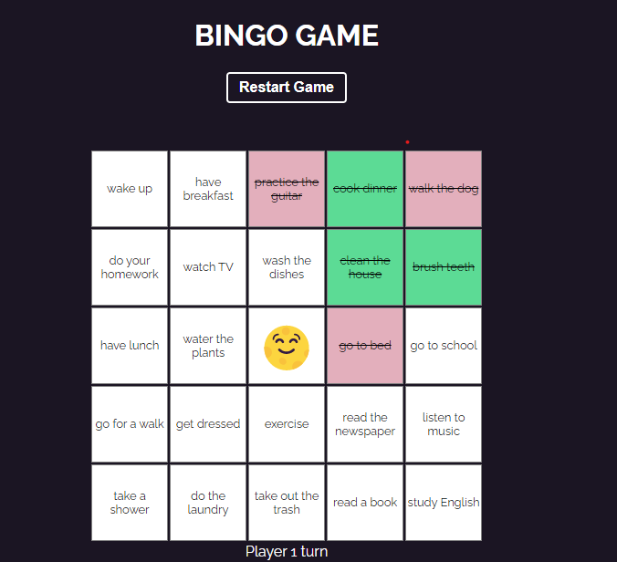
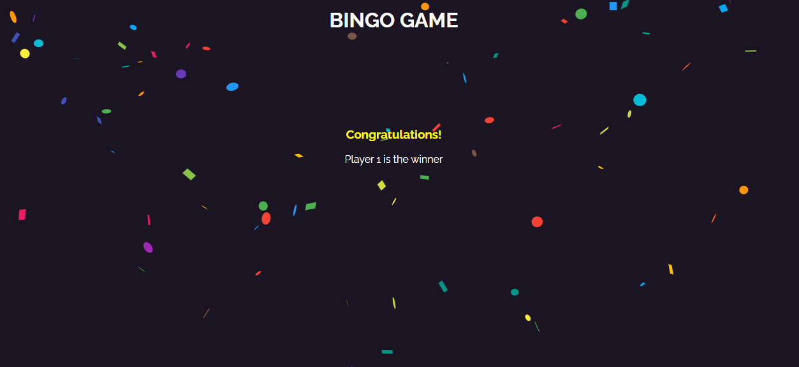

# Bingo App
Todo list is the considerable notes that almost every eager beaver have it their computer, mobile or notebook. it seems amusing to exchange it with a colleague in a nifty fun game structure.
A list of common todo list is randomly placed in bingo card. A player win by completing row, column or diagonal. The app is Built with ReactJs and some CSS.

**App Specification:**

- A player wins by completing a row, column, or diagonal.
- There's a free slot (always on) in the middle
- Only one bingo 
- Two player can compete
- Responsive
- one can win



## Installation

Clone down this repository. You will need node and npm installed globally on your machine.

Installation:
```bash
npm install
```
To Run Test Suite:
```bash
npm test
```
To Start Server:
```bash
npm start
```
To Visit App:
```bash
http://localhost:3000
```

## Contributing

Pull requests are welcome. 

## License

[MIT](https://choosealicense.com/licenses/mit/)